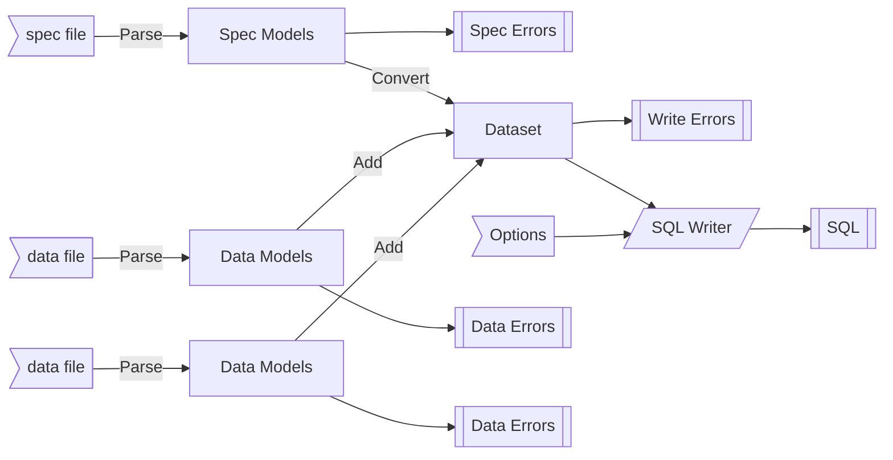

# Aqorn
> **Acorn /ˈeɪkɔːn/:** The fruit of the oak tree and favoured food of squirrels.

Generate complex SQL inserts from a human-readable data model.

# Usage
The command takes 3 input parameters:
1. [ `-s` / `--spec` ]: (Required) The location of the data model specification file.
2. [ `-d` / `--data` ]: (Required) One or more data files to parse against the specification.
3. `-p` / `--param`: Parameter overrides.
   - One or more named parameters in format `-p:name value`.
   - One or more files containing a dictionary of parameter values.
   - One or more dictionaries of parameter values.

Single file parsing:  
```sh
aqorn "spec.jsonc" "data.jsonc"
aqorn -s "spec.jsonc" -d "data.jsonc"
```

Multi-file parsing:  
```sh
aqorn "spec.jsonc" "data1.jsonc" "data2.jsonc" "data3.jsonc"
aqorn -s "spec.jsonc" -d "data1.jsonc" "data2.jsonc" "data3.jsonc"
```

Providing parameters:
```sh
aqorn "spec.jsonc" "data.jsonc" -p:name "Test" -p:state "Active"
aqorn -s "spec.jsonc" -d "data.jsonc" -p:name "Test" -p:state "Active"
```

# Example
```jsonc
// spec.jsonc
{
    "dbo.MyTable": { // Table to insert into
        "Id": "!number", // Required numeric value
        "Value": "?string" // Optional string value
    }
}
```
```jsonc
// data.jsonc
{
    "dbo.MyTable": [
        { "Id": 1, "Value": "One" },
        { "Id": 2, "Value": "Two" }
    ]
}
```

```sql
-- MSSQL output
INSERT INTO [dbo].[MyTable]([Id], [Value]) VALUES
    (1, 'One'),
    (2, 'Two')
```

# Diagram


# Future
* Reference parent insert
    e.g., "^ParentId" for inserted identity
* Options
    * Output as JSONC valid against spec
    * Use transaction
    * Exclude print progress statements
    * Size of insert batch
    * Insert structure choices?
* Yaml source support
* Reference child insert
    e.g., Parent.:relations.Child insert id is used by Parent (">Child.ChildId")
* Limit relationships to 1 item